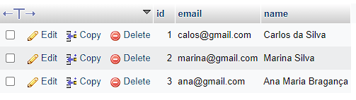

# JPA Class
This project I created to study how to work with JPA and Hibernate implamantation.

## About the project

### IDE
IntelliJ IDEA Community Edition 2022.1.4

### Dependencies
All dependencies for this project are configured by Maven, and you can check them out [here](pom.xml).

## How to test
### Install XAMPP or MySQL Workbench
You will need one of these tools (or similar) to create database and check the results.

### Clone this project to your workspace.
In your workspace folder, execute this command on git bash to clone this repository.

````bash
git clone https://github.com/IsmaelMoura/jpa-hibernate-class
````

### Create the database
In MySQL, execute this command to create de database.

````roomsql
CREATE DATABASE jpa_hibernate_class;
````

### Run the main class
This piece of code adds three entities to the MySQL database.

- [Program class](src/main/java/application/Program.java)
### See the result in MySQL.
After run the main class, the database will be like this:

